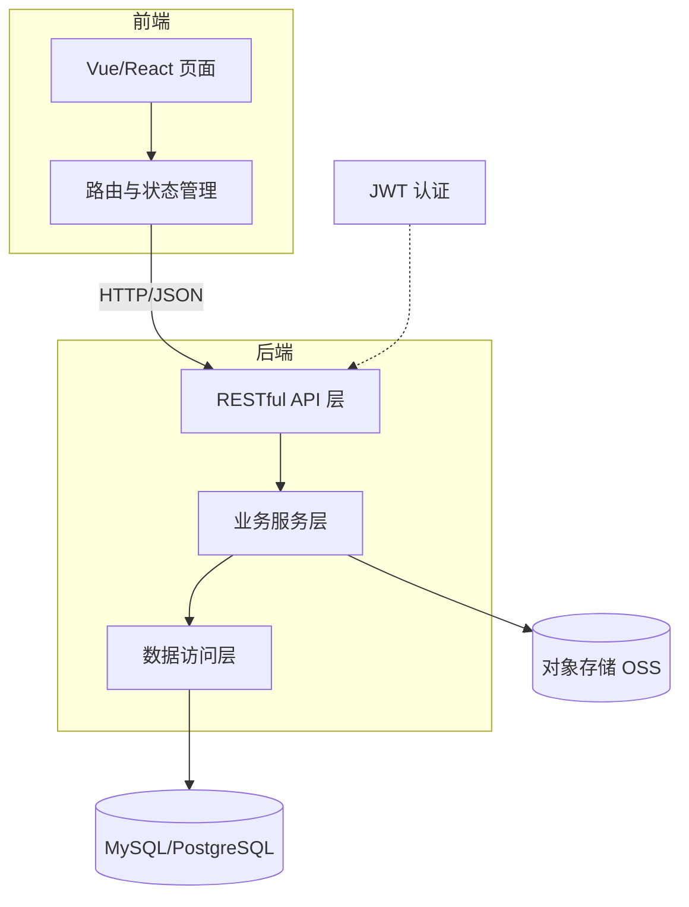

# 工程设计、实现与测试

**总原则**：毕业设计的核心是一个**真实可运行的系统**。文档与代码必须互相印证：论文里的每张截图、每个数据都来自真实运行。

## 1. 需求分析（产出：03-设计/需求分析.md）

- **功能需求 FR-x**：编号 + 功能 + 说明 + 优先级（高/中/低）。每条 FR 必须在实现与测试中有对应物。
- **非功能需求 NFR-x**：性能、安全、易用性、兼容性等，要求**可度量**（如"列表页加载 < 2s"），不写"系统性能良好"。
- **用例**：核心 3-5 个用例：参与者 → 操作 → 系统响应。非核心功能合并描述即可。
- 范围纪律：需求由"选题确认书的工作量评估"约束；用户要加需求时，先讨论是否放入"可选功能"缓冲区。

## 2. 系统设计（产出：03-设计/系统设计.md）

- **总体架构**：分层或模块图（Mermaid flowchart / architecture），每层职责一句话。
- **模块划分**：模块 | 职责 | 对外接口。模块间低耦合；每个模块能在代码里找到对应目录/文件。
- **数据库设计**：ER 图 + 关键表结构（字段、类型、约束、索引依据）。
- **接口设计**：API 表：路径 | 方法 | 参数 | 返回。前后端分离的必须有；单体应用写关键路由。

### 2.1 Web 前后端分离架构模板（Mermaid，可直接改造）

设计时说明：每层的职责边界（API 层只做参数校验与路由，业务逻辑在服务层——答辩高频追问点）、认证方案（JWT/Session 的选择与理由）、数据一致性策略。

## 3. 技术选型论证（产出：03-设计/技术选型论证.md）

每个选型：选择 | 理由 | 备选 | 弃用备选的原因。**理由必须具体**（生态、学习成本、性能、与需求的匹配），禁止"因为它流行"。
同步用 thesis_decide 记入决定日志——答辩老师 90% 会问"为什么选这个技术"。

## 4. 实现（产出：04-实现 中的真实代码）

- **可运行优先**：先跑通最小可用版本（端到端），再逐功能完善；永远保持仓库处于可运行状态。
- **git 提交纪律**：一个功能/修复一次提交；提交信息写清"做了什么、为什么"；每次提交前代码能编译/运行。
- **AI 分工**：AI 承担编码主力，但每次功能完成后：①编译/运行验证通过 ②给用户讲解关键代码（答辩素材）③用户验收。
- **代码评审要点**（AI 自查 + 用户验收时对照）：
  1. 命名有意义（函数/变量表意图，不用 a/b/tmp）
  2. 关键逻辑注释写"为什么"，不只"是什么"
  3. 异常处理：外部调用（数据库/网络/文件）有 try/catch 或统一异常层；不吞异常
  4. 日志：关键路径有日志（入参、耗时、错误），不含敏感信息
  5. 配置与代码分离（密钥不进 git——.gitignore 与 .env.example 双保险）
  6. 无死代码、无大段注释掉的代码
- 中期检查（如学校有）：整理进度报告——已完成功能清单 + 现场演示 + 剩余计划与风险。

### 4.1 中期检查材料清单（学校安排中期检查时用）

1. 进度报告（已完成 / 进行中 / 未开始，对照任务书进度安排）
2. 可演示的运行版本（提前在演示环境跑通，准备离线兜底）
3. 已完成功能与关键代码讲解要点（导师爱问"最近在做什么、卡在哪"）
4. 下一步计划与风险（卡点如实说，需要导师决策的提前列出来）

## 5. 测试（产出：05-实验测试 的真实结果）

- **测试计划**：用例 ID | 对应需求 | 步骤 | 预期结果。
- **测试类型清单**（毕设常见组合，按需选用）：

| 类型 | 验证什么 | 常用工具 | 论文呈现 |
|---|---|---|---|
| 单元测试 | 函数/模块正确性 | Jest/Pytest | 覆盖率 + 关键用例举例 |
| 集成/接口测试 | 模块间与 API 契约 | Postman/Supertest/pytest | 接口用例表 |
| 系统/功能测试 | 端到端业务功能 | 手工+截图 | 功能测试用例表（对应 FR-x） |
| 性能测试 | 响应时间/吞吐 | ab/JMeter/Locust | 对比图/表（真实数据） |
| 安全测试 | 越权/注入/XSS | 手工+扫描器 | 关键项结论（可选） |

- **执行与留证（红线）**：所有结果真实运行获得；截图/日志/数据存 05-实验测试/结果/，并注明复现步骤；**禁止伪造或"P 图"**。
- 失败用例：记录现象 → 定位原因 → 修复 → 回归，全部留痕（论文第六章的"测试结果与分析"直接用）。
- 性能测试（如适用）：用真实工具（如 ab、JMeter）测，数据存档。

## 6. 与论文的对应关系（写作时必读）

| 文档 | 论文章节 |
|---|---|
| 需求分析.md | 第 3 章 需求分析 |
| 系统设计.md + 技术选型论证.md | 第 4 章 系统设计 |
| 04-实现 代码 | 第 5 章 系统实现 |
| 测试计划.md + 结果/ | 第 6 章 系统测试 |
